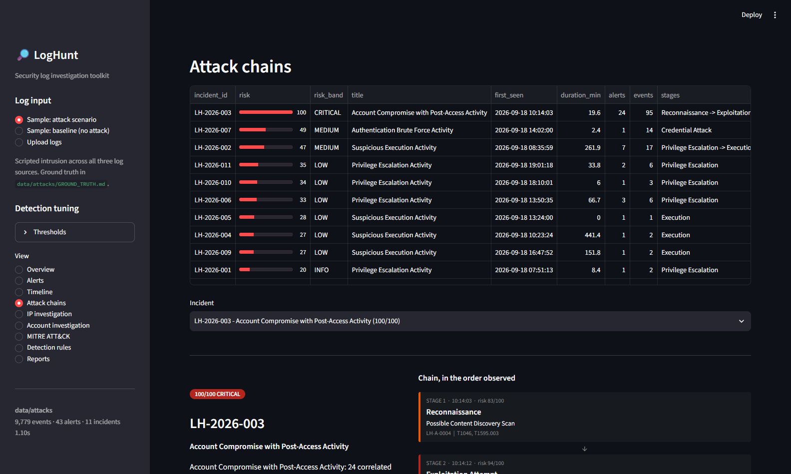
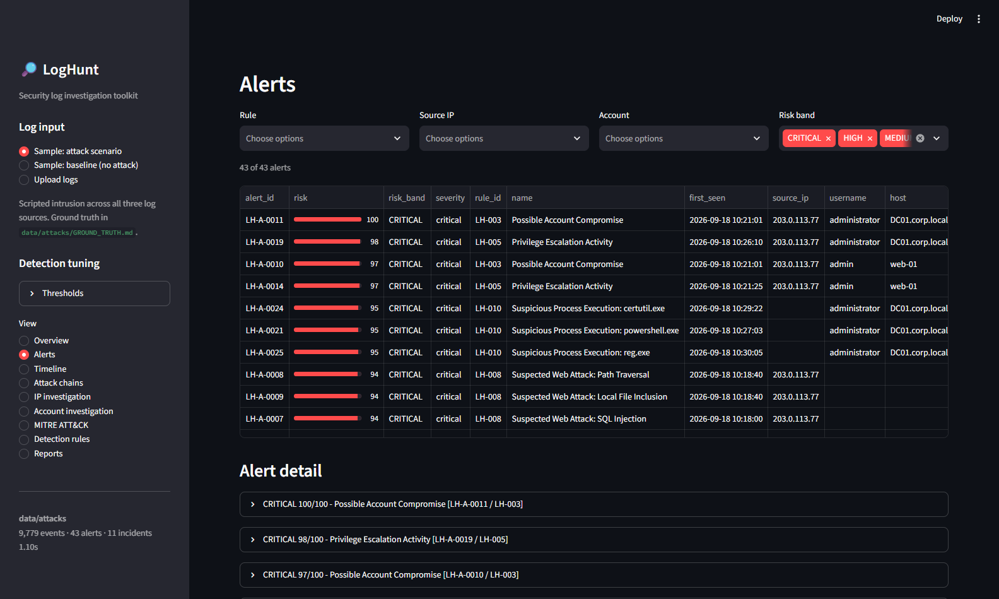
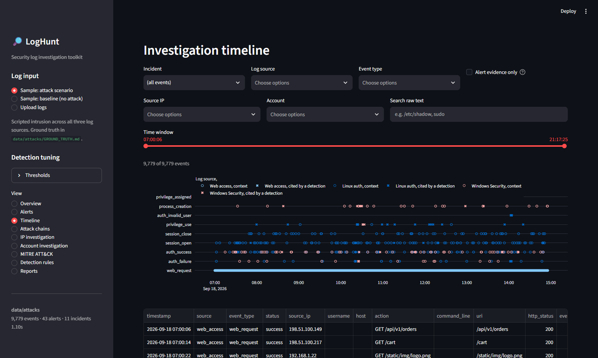

# LogHunt

**Security log investigation and threat hunting toolkit.**

LogHunt ingests Linux, Windows and web server logs, normalizes them into one
event schema, runs detection rules across all of them, correlates the findings
into incidents, scores those incidents, and produces an investigation report.

It is not a SIEM. It is the part of an analyst's workflow that turns a pile of
log lines into an answer to "what happened, to whom, and what do I check next".

```
             LOG FILES                 auth.log · security.log · access.log
                 |
                 v
          Log parsers                  format detection by parser vote
                 |
                 v
        Normalization                  one 20-field event schema
                 |
        +--------+--------+
        v                 v
  Detection engine     Statistics      11 rules / 6 families
        |
        v
  Event correlation                    alerts -> incidents, by entity + time
        |
        v
    Risk scoring                       severity + frequency + context + chain
        |
        v
 Investigation dashboard               timeline · IP · account · ATT&CK · report
```

---

## Problem

Three problems show up in every log investigation, and none of them are solved
by a log parser:

1. **An alert with no context is unactionable.** "Brute force from 203.0.113.77"
   is background noise on any internet-facing host. "Brute force followed by a
   successful login, then a privileged command, then an encoded PowerShell
   payload — same address, twenty minutes" is an incident.
2. **A severity label cannot rank a queue.** Twenty "HIGH" alerts still leave
   the analyst picking at random.
3. **Evidence lives in different files with different formats.** The attack
   crosses the web log, the auth log and the Windows event log; the analyst
   has to join them by hand.

LogHunt addresses all three: it normalizes the sources so one rule covers them
all, correlates alerts into a chain, and scores each finding out of 100 with
the breakdown shown.

---

## Features

- **Three log formats**, detected automatically — Linux auth (syslog and
  RFC3339), Windows Security (Event Viewer text, CSV, or JSON), and
  Apache/Nginx access logs (common and combined).
- **11 detection rules** across 6 families, every one working on the
  normalized schema so it covers all applicable sources at once.
- **Event correlation** into incidents, with the attack chain shown in the
  order it was observed.
- **Risk scoring out of 100**, always with the breakdown: base severity +
  frequency + context + correlation. Nothing shows a bare number.
- **Investigation views** — timeline with filters, per-IP and per-account
  pivots, MITRE ATT&CK coverage.
- **Markdown incident reports** with summary, assessment, chain, detections,
  timeline, raw evidence, ATT&CK mapping and recommended next steps.
- **A reproducible attack scenario** plus a matching clean baseline, so
  detections can be measured against ground truth rather than asserted.
- **80 tests**, including end-to-end tests that assert both detection on the
  attack dataset and silence on the baseline.

---

## Architecture

```
LogHunt/
├── app.py                      Streamlit dashboard (9 views)
├── parser/
│   ├── schema.py               normalized Event + DataFrame contract
│   ├── linux.py                auth.log / secure
│   ├── windows.py              Security log: text blocks, CSV, JSON
│   ├── web.py                  Apache/Nginx access logs
│   └── __init__.py             format detection and merging
├── detection/
│   ├── base.py                 Alert, DetectionConfig, sliding-window helper
│   ├── brute_force.py          LH-001, LH-002
│   ├── suspicious_login.py     LH-003, LH-004
│   ├── privilege.py            LH-005, LH-006, LH-007
│   ├── web_attack.py           LH-008, LH-009
│   ├── suspicious_process.py   LH-010, LH-011
│   ├── mitre.py                ATT&CK technique catalogue
│   └── __init__.py             rule catalogue + run_all
├── correlation/engine.py       alerts -> incidents, attack chains
├── scoring/risk.py             alert and incident risk
├── reports/generator.py        Markdown investigation reports
├── tools/
│   ├── generate_scenario.py    the sample datasets
│   └── capture_screenshots.py  README screenshots
├── data/
│   ├── normal/                 background activity only
│   └── attacks/                background + one scripted intrusion
├── tests/                      80 tests
└── screenshots/
```

Every stage hands the next one a plain `pandas.DataFrame` or a list of
dataclasses, so any stage can be used on its own:

```python
import parser
from detection import DetectionConfig, run_all
from correlation import correlate
from scoring import risk
from reports import incident_report

result = parser.parse_files(["data/attacks/auth.log", "data/attacks/access.log"])
config = DetectionConfig()
alerts = risk.score_alerts(run_all(result.events, config), config)
incidents = correlate(alerts, result.events, config)
print(incident_report(incidents[0], result.events))
```

### The normalized event

Every parser produces the same record, which is what lets one rule cover
three log sources:

```
timestamp   source        host          source_ip     username
event_type  action        status        process       command_line
http_method uri           http_status   user_agent    bytes_sent
event_code  logon_type    raw           line_no       destination_ip
```

`event_type` is a deliberately small vocabulary — `auth_failure`,
`auth_success`, `auth_invalid_user`, `privilege_use`, `privilege_assigned`,
`process_creation`, `web_request`, `session_open`, `session_close`, `other`.
Rules match on those, never on raw strings.

---

## Detection rules

| Rule | Family | Logic | ATT&CK |
|---|---|---|---|
| LH-001 | Brute force | 5+ failed authentications against one account from one source IP within 5 minutes | T1110.001, T1110 |
| LH-002 | Brute force | 5+ failures from one source IP across 5+ distinct accounts in the window | T1110.003 |
| LH-003 | Login after brute force | A successful authentication within 10 minutes of a burst of failures from the same source IP | T1110, T1078 |
| LH-004 | Anomalous login source | A successful login from a /24 outside the networks covering 80% of that account's own login history | T1078 |
| LH-005 | Privilege escalation | Privileged actions (sudo, event 4672, account changes) within 15 minutes of a successful login by the same account | T1078, T1548.003 |
| LH-006 | Privilege escalation | Account creation, privileged group change, or a cleared security audit log | T1136.001, T1098, T1070.001 |
| LH-007 | Privilege escalation | Denied sudo / not-in-sudoers attempts | T1548.003 |
| LH-008 | Web attack | 8 signature classes matched against doubly URL-decoded requests; severity rises when the response was 2xx | T1190, T1083, T1059, T1505.003 |
| LH-009 | Web attack | 20+ HTTP 404s from one source in 5 minutes, or a self-identifying scanner user agent | T1595.003, T1046 |
| LH-010 | Suspicious process | Watched interpreters and LOLBins from event 4688; command-line indicators raise severity | T1059.001, T1059.003, T1105, T1003 |
| LH-011 | Suspicious process | The same command-line indicators applied to commands run via sudo | T1059.004, T1003.008, T1105 |

Every threshold in that table is a field on `DetectionConfig` and a slider in
the dashboard sidebar.

Three decisions are worth calling out, because they are what keep the alert
queue readable:

- **The binary is not the alert; the command line is.** `cmd.exe /c dir` is
  `low`. `powershell.exe -nop -w hidden -enc <base64>` is `critical`. A flat
  "these binaries are suspicious" list produces a queue nobody reads.
- **Web findings say *suspected*.** A signature match proves a payload was
  sent, not that the application was vulnerable. The HTTP status sits next to
  every finding, because a 200 on an injection attempt is the thing that
  matters.
- **Routine sudo is `low` by default.** An administrator using sudo is the
  most common line in an auth log. LH-005 exists to supply context to a chain,
  not to page anyone on its own; a sensitive command or an external source
  address is what lifts it.

---

## Risk scoring

```
risk = base severity      (by rule severity, 5-70)
     + frequency          (volume, flat curve, max 10)
     + context            (privileged account, critical asset, external
                           source, payload served, max 12)
     + correlation        (stages of the chain this alert sits in, max 14)
```

Clamped to 0-100, then banded: CRITICAL 85+, HIGH 65-84, MEDIUM 45-64,
LOW 25-44, INFO below 25.

The breakdown is stored on the alert and displayed wherever the score is, and
the factor list is trimmed so it always adds up to the score shown — including
a "capped at the 100-point ceiling" row when an alert saturates. For the
compromise of `administrator` in the sample scenario:

```
 70  base severity (critical)
  8  event frequency (30 events)
  4  privileged account
  4  business-critical asset
  3  external source address
 10  part of a 7-stage attack chain
  4  chain spans multiple log sources
 -3  capped at the 100-point ceiling
---
100/100 CRITICAL
```

Correlation is a genuine feedback loop, not decoration: alerts are scored,
grouped into incidents, then **re-scored** now that the chain is known. The
same 17-failure brute force scores lower alone than it does when followed by a
login and a privileged command — `test_correlation_raises_the_risk_of_an_alert_in_a_chain`
asserts exactly that.

An incident scores at least its worst alert, plus credit for chain breadth,
corroboration across log sources, and alert volume.

---

## Event correlation

Alerts are grouped by shared entity and time proximity: for each entity, the
alerts are sorted and linked when the gap between one ending and the next
starting is inside the correlation window (30 minutes by default).

The linking keys are **source IP and account, deliberately not host**. Host was
tried first and over-merged badly — on a busy server every unrelated alert of
the afternoon collapsed into one 10-hour "incident" spanning three unrelated
actors. IP and account still carry the chain across log sources: the attacker's
address ties the web exploitation to the SSH brute force, and the account ties
the Windows process events (which carry no client address) back to the logon
that spawned them.

Each incident is then labelled with the stages it evidences, **in the order
they were observed** rather than in canonical kill-chain order, because a real
intruder does not follow the diagram.

---

## Attack scenario

`tools/generate_scenario.py` writes two datasets from one seeded generator:
`data/normal/` (background activity only) and `data/attacks/` (the same
background with one intrusion woven through it). Re-running it reproduces both
byte for byte. The planted activity is written to
[`data/attacks/GROUND_TRUTH.md`](data/attacks/GROUND_TRUTH.md).

Attacker addresses come from the documentation ranges reserved by RFC 5737, so
the samples never point at real hosts.

The intrusion, from `203.0.113.77` on 2026-09-18:

| Time | Stage | Activity | Log source |
|---|---|---|---|
| 10:14 | Reconnaissance | 41 path probes, mostly 404, `gobuster` user agent | access.log |
| 10:18 | Exploitation | 5 SQL injection and 3 traversal/LFI attempts, some answered 200 | access.log |
| 10:21:01 | Credential attack | 17 failed SSH passwords for `admin` in 22 seconds | auth.log |
| 10:21:24 | Successful access | SSH password accepted for `admin`, 1s after the last failure | auth.log |
| 10:23 | Privilege escalation | 5 sudo commands: reads `/etc/shadow`, downloads a payload, `chmod 777`, creates a UID 0 account, clears history | auth.log |
| 10:25 | Lateral credential attack | 12 × event 4625 for `administrator` on the DC, then 4624 (RDP) and 4672 | security.log |
| 10:27 | Execution | Encoded PowerShell download cradle, discovery, `certutil` transfer, SAM hive export | security.log |
| 10:31 | Persistence / evasion | Local account created, added to Administrators, security audit log cleared | security.log |

A second, unrelated actor (`198.51.100.23`) sprays one password across seven
accounts at 14:02 — included to prove incidents stay separate instead of
collapsing into one.

---

## Results

Measured on the generated datasets, not estimated. Reproduce with
`python tools/generate_scenario.py` then `python -m pytest`.

### Attack dataset — `data/attacks/`

| Metric | Value |
|---|---|
| Events parsed | **9,779** (9,049 web · 524 Linux auth · 206 Windows) |
| Alerts raised | **43** |
| Critical / high risk alerts | **16 / 5** |
| Incidents correlated | **11** |
| Critical incidents | **1** |
| ATT&CK techniques mapped | **22** |
| Detection rules fired | **10 of 11** (LH-007 needs a denied sudo, not in this scenario) |
| Pipeline runtime | **~1.1s** end to end |

The top incident, `LH-2026-003`, reconstructs the whole intrusion:
**100/100 CRITICAL**, 24 correlated alerts, 95 supporting events, 7 stages,
20 minutes, all three log sources, one source address.

Every planted stage is detected. `tests/test_scenario.py` asserts this against
ground truth — including the exact attempt count (17) and that the compromise
of `admin` is `critical` with under 5 seconds between the last failure and the
success.

### Baseline dataset — `data/normal/`

The same rules, same thresholds, on 9,669 events of background activity with
no attack in them:

| Metric | Value |
|---|---|
| Alerts at medium severity or worse | **0** |
| Alerts total | 18, all `low` or `info` |
| Attack-only rules that fired | **0 of 6** (LH-001, LH-002, LH-003, LH-004, LH-008, LH-009) |
| Highest incident risk | 47/100 (MEDIUM) |

The 18 remaining alerts are routine administration — `alice` using sudo, and
`cmd.exe` running — kept deliberately at `low` as timeline context rather than
suppressed. That distinction is the point: the rules separate "worth knowing"
from "worth waking someone up for".

---

## Screenshots

| | |
|---|---|
|  |  |
| Overview — the highest-risk incident and its chain up front | Attack chains — stages in observed order, with the score breakdown |
|  |  |
| Alerts — ranked by risk, each expandable to its evidence | Timeline — filter by incident, source, account, type or raw text |
|  |  |
| IP investigation — everything one address did | ATT&CK coverage by technique and tactic |

More in [`screenshots/`](screenshots/). Regenerate with
`python tools/capture_screenshots.py --url http://localhost:8501`.

---

## Installation

Python 3.11 or newer.

```bash
git clone https://github.com/Rizzykun/LogHunt.git
cd LogHunt
python -m pip install -r requirements.txt
python tools/generate_scenario.py     # writes data/normal and data/attacks
```

### Docker

```bash
docker build -t loghunt .
docker run --rm -p 8501:8501 loghunt
```

---

## Usage

### Dashboard

```bash
streamlit run app.py
```

Then pick a sample dataset or upload your own logs from the sidebar. The nine
views are Overview, Alerts, Timeline, Attack chains, IP investigation, Account
investigation, MITRE ATT&CK, Detection rules and Reports.

### Reports from the command line

```bash
python -m tools.report data/attacks --out investigation.md
```

### Tests

```bash
python -m pytest              # 80 tests
python -m pytest -k scenario  # the end-to-end ground-truth tests
```

### Regenerate the sample data

```bash
python tools/generate_scenario.py --seed 1337 --date 2026-09-18
```

---

## Limitations

These are real constraints, not future features:

- **Detection is threshold and signature based.** There is no machine learning
  and no behavioural baselining beyond LH-004's per-account source history.
  A patient attacker who stays under the thresholds is not detected.
- **Signature matches prove an attempt, not a compromise.** LH-008 says a SQL
  injection payload was *sent*. Confirming it worked needs the application and
  database logs, which is why the report says so and lists the response codes.
- **Correlation can over-merge or under-merge.** It groups on source IP and
  account within a time window. An attacker who changes both between stages
  breaks the chain; a shared NAT address or a service account used widely
  merges unrelated activity. The window is tunable and the linking keys are
  documented above.
- **Privileged Linux actions carry no source address.** A `sudo` line in
  `auth.log` does not record the client IP, so on the IP investigation page an
  attacker's address shows 0 privileged actions even though the alerts for
  those actions are listed right below it. Attributing sudo to a session IP is
  possible but would be a guess when sessions overlap, so it is not done.
- **Routine administration correlates into low-risk incidents.** `alice` using
  sudo across several hosts becomes a LOW/MEDIUM incident. That is intended —
  it is context an analyst can dismiss in one glance, not a finding.
- **Timestamps are trusted as written.** No clock-skew correction between
  hosts, and syslog's missing year is inferred (with new-year rollover
  handling) rather than known.
- **Windows support covers exported text, CSV and JSON, not `.evtx`.** Binary
  EVTX parsing would need `python-evtx` or `wevtutil` preprocessing.
- **The sample data is synthetic.** It was written to exercise these rules, so
  the results above measure the rules against a known scenario — not against
  real-world traffic.

---

## Future work

In rough order of value:

1. **EVTX and Sysmon support** — binary event log parsing, and Sysmon event 1
   (process creation with hashes and parent process) and event 3 (network
   connections), which would make LH-010 far stronger.
2. **Session reconstruction for Linux** — track PID and session IDs through
   `auth.log` so sudo activity inherits its session's source address.
3. **Threat intelligence enrichment** — reputation and ASN lookups for source
   addresses, feeding the context component of the risk score.
4. **Sigma rule import** — the detection engine already separates rule logic
   from the normalized schema; loading Sigma rules would be a natural fit.
5. **Persistence** — SQLite storage so cases survive a restart and baselines
   build across datasets rather than from one file.
6. **Detection tuning as data** — thresholds in YAML per environment, with
   per-rule allowlists.

Deliberately out of scope: real-time monitoring, multi-user access, and a
custom SIEM backend. Those are different products.

---

## Related work

**CA-IDPS** (my final year project) detects and prevents web attacks in real
time. LogHunt is the other half of that story: investigating the evidence an
attack leaves behind. One stops the request; the other reconstructs what the
request was part of.
